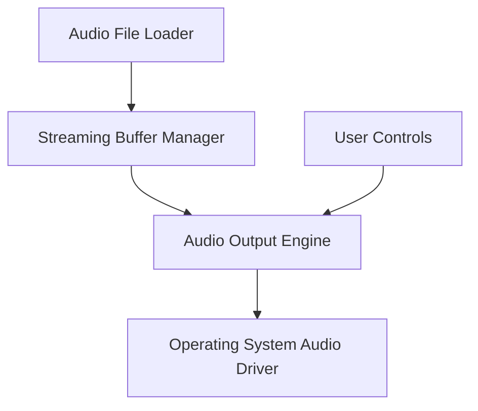

# 🎵 Real-Time Audio Player (C++17)

A lightweight, real-time audio playback engine built in **Modern C++ (C++17)**.

This project demonstrates **low-latency streaming**, **buffer management**, and **real-time audio processing** — skills essential for embedded systems, DSP tools, and performance-critical applications.

---

## 🚀 Features

- 🔊 **Low-latency audio playback**
- 🔄 **Double-buffering system** for smooth streaming
- 🎛️ Volume and playback controls
- 🧠 Efficient memory handling using RAII & smart pointers
- 📦 Modular architecture for easy extension

---

## 🧩 Architecture Overview



---

## 🛠️ Build Instructions

### Requirements

- CMake ≥ 3.10
- C++17 compiler
- PortAudio or SDL2 (depending on your backend)

### Build

```bash
mkdir build && cd build
cmake ..
make
```

### Run

```bash
./audio_player path/to/audio.wav
```

---

## 📁 Project Structure

```
src/
 ├── AudioPlayer.cpp
 ├── BufferManager.cpp
 ├── main.cpp
include/
 ├── AudioPlayer.hpp
 ├── BufferManager.hpp
```

---

## 💡 What I Learned

- Real-time systems design
- Double-buffering & synchronization
- Low-level audio streaming
- RAII-based memory safety

---

## 🚧 Future Improvements

- Add spectrum visualization
- Add MP3/FLAC decoder
- Add GUI using Qt
